# scsx-market

一个超市进销存系统

## 目录 <!-- omit in toc -->

- [安装](#安装)
- [使用说明](#使用说明)
  - [服务器启动](#服务器启动)
  - [注册第一个管理用户](#注册第一个管理用户)
  - [管理页面](#管理页面)
    - [供应商管理](#供应商管理)
    - [员工管理](#员工管理)
    - [商品管理](#商品管理)
    - [订单管理](#订单管理)
  - [浏览页面](#浏览页面)
    - [商品浏览](#商品浏览)
    - [订单浏览](#订单浏览)
- [使用技术](#使用技术)
  - [前端](#前端)
  - [后端](#后端)
  - [数据库](#数据库)
- [制作](#制作)

## 安装

下载项目并进入目录：

```shell
git clone git@github.com:KZNS/scsx-market.git
cd scsx-market
```

本项目后端使用Python3，你可以通过一下命令安装依赖:

```shell
pip install -r requirements.txt
```

## 使用说明

### 服务器启动

启动后端服务：

```shell
python serve.py
```

之后可以通过服务器地址在公网中访问  
或者可以通过以下地址在本地访问：

<http://127.0.0.1:5000>

### 注册第一个管理用户

第一次打开网站后，点击“注册”按钮注册用户  
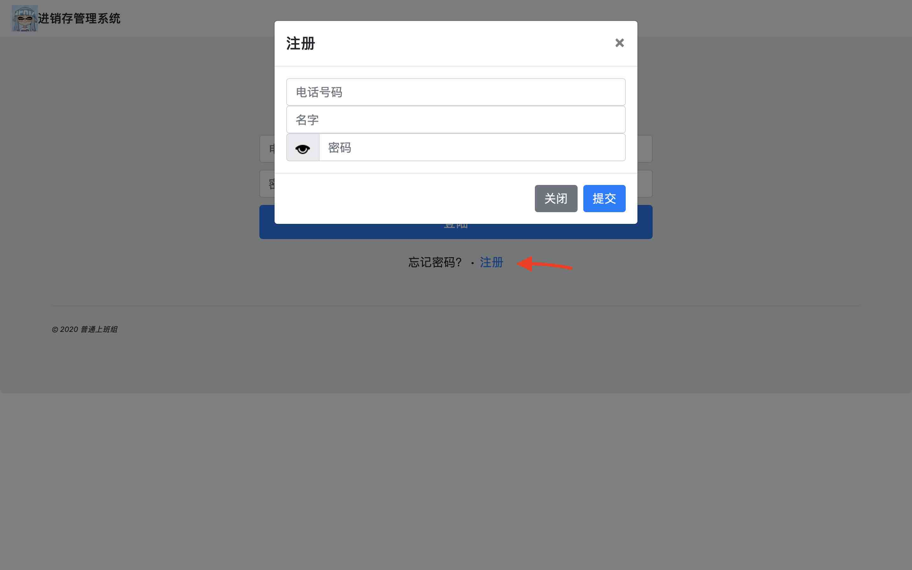  
注册完成后输入账户密码登录  
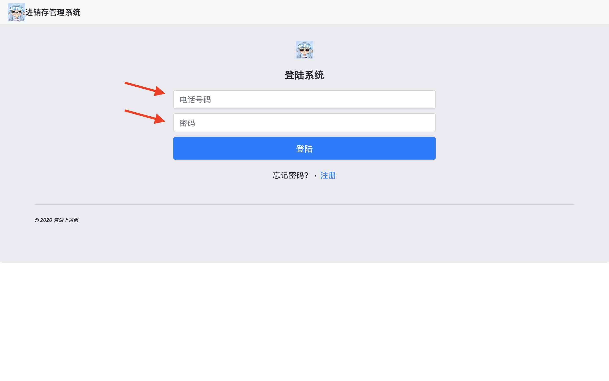
登录完成后，访问以下链接获取admin权限

<http://127.0.0.1:5000/admin>

之后会自动返回登录页面，重新登录即可。

注意该admin页面只能在没有管理用户时访问，添加更多的管理用户应该通过用户管理页面完成。

### 管理页面

以管理员用户登录后，进入管理页面。
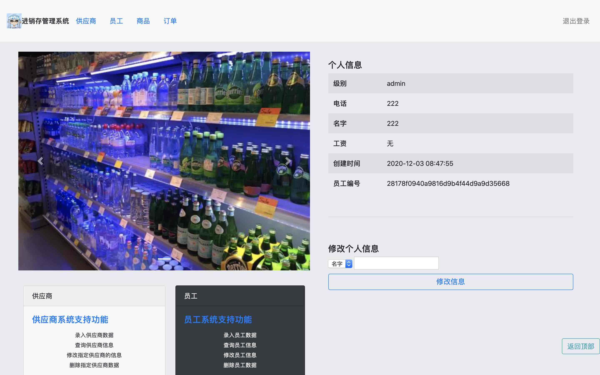
可以通过上面的导航栏按钮，或下面的功能卡片进入对应的管理功能。  
也可以在右侧修改本人的用户信息。

在任意界面，可以点击左上角图标回到管理页面。

#### 供应商管理

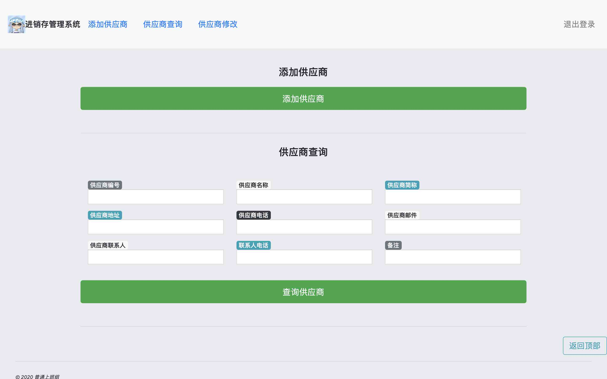

可以填写一些供应商信息进行供应商查询，留空则不限制。  
查询支持模糊查询，可以输入信息的一部分进行查询。

查询结果右侧按钮可以对当前条目进行修改或者删除。
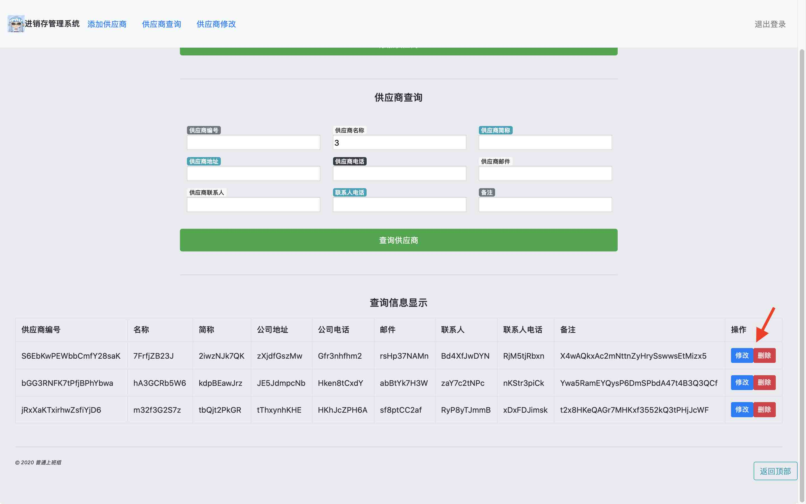

点击“添加供应商”可以填写数据添加新的供应商。
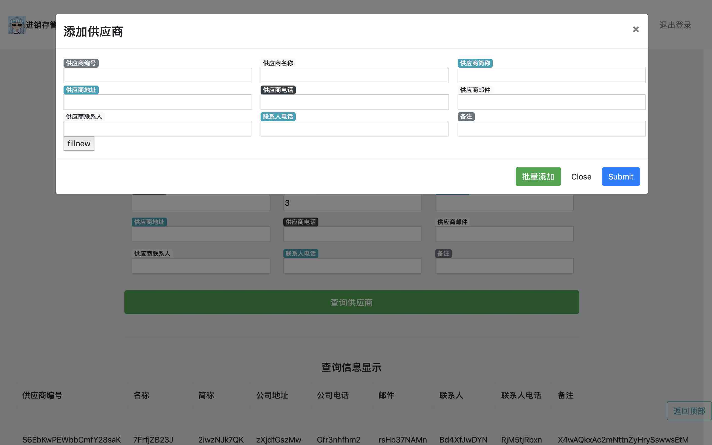

在添加供应商的窗口中，可以选择“批量添加”批量添加供应商  
数据使用逗号`,`分割，换行符`\n`分条：

```text
供应商编号,供应商名称,供应商简称,地址,公司电话,邮件,联系人,联系人电话,备注
供应商编号,供应商名称,供应商简称,地址,公司电话,邮件,联系人,联系人电话,备注
...
供应商编号,供应商名称,供应商简称,地址,公司电话,邮件,联系人,联系人电话,备注
```

#### 员工管理

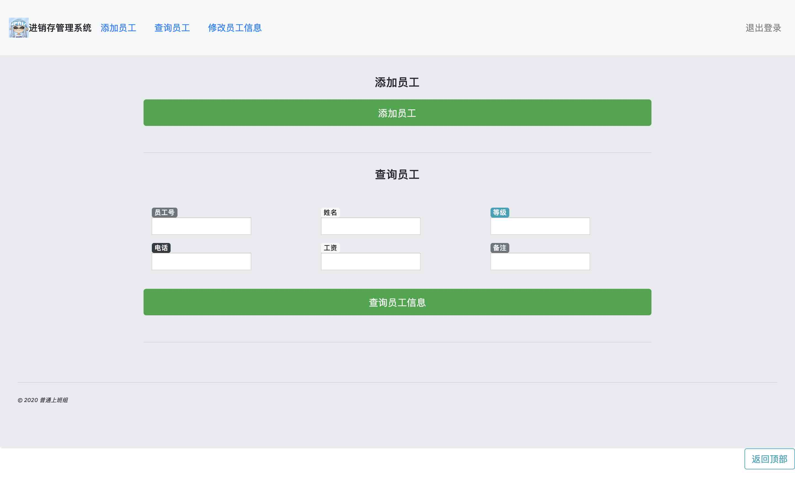
搜索，修改，删除和添加与供应商管理类似。

批量添加数据使用逗号`,`分割，换行符`\n`分条：

```text
员工编号,员工姓名,员工级别,员工电话,员工工资,备注
员工编号,员工姓名,员工级别,员工电话,员工工资,备注
...
员工编号,员工姓名,员工级别,员工电话,员工工资,备注
```

批量添加的用户默认密码为`12345678`

#### 商品管理

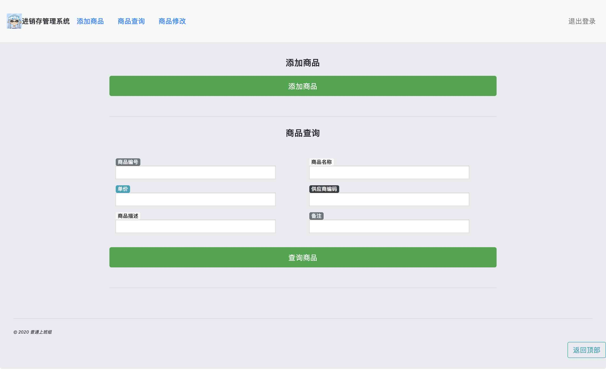
搜索，修改，删除和添加与供应商管理类似。

批量添加数据使用逗号`,`分割，换行符`\n`分条：

```text
商品编号,商品名称,商品单价,供应商编号,商品简介,备注
商品编号,商品名称,商品单价,供应商编号,商品简介,备注
...
商品编号,商品名称,商品单价,供应商编号,商品简介,备注
```

#### 订单管理

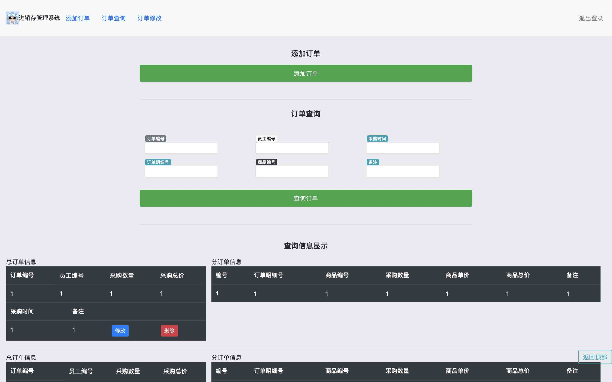
订单包括主订单与订单明细。  
可以输入主订单信息进行查询，修改与删除显示在页面左侧。

批量添加数据使用逗号`,`分割，换行符分条，分号`;`分订单：

```text
订单编号,员工编号,采购数量,采购总价,采购时间,备注
明细号,商品编号,采购数量,商品单价,商品总价,备注
明细号,商品编号,采购数量,商品单价,商品总价,备注;
订单编号,员工编号,采购数量,采购总价,采购时间,备注
明细号,商品编号,采购数量,商品单价,商品总价,备注
明细号,商品编号,采购数量,商品单价,商品总价,备注
明细号,商品编号,采购数量,商品单价,商品总价,备注;
...
订单编号,员工编号,采购数量,采购总价,采购时间,备注
明细号,商品编号,采购数量,商品单价,商品总价,备注
明细号,商品编号,采购数量,商品单价,商品总价,备注
...
明细号,商品编号,采购数量,商品单价,商品总价,备注
```

### 浏览页面

以普通用户登录后，进入浏览页面。
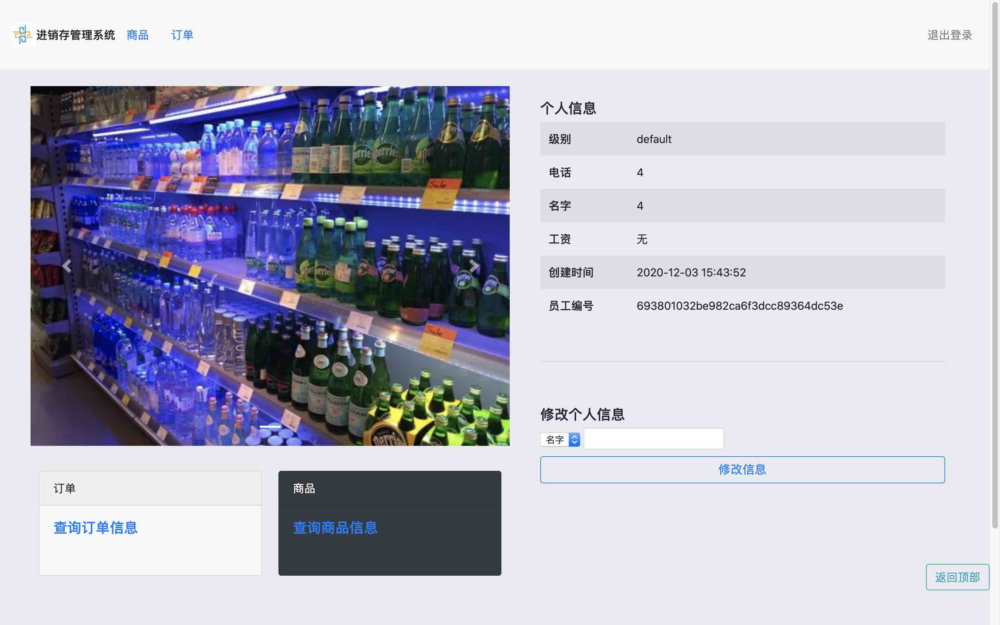
可以通过上面的导航栏按钮，或下面的功能卡片进入对应的浏览功能。  
也可以在右侧修改本人的用户信息。

在任意界面，可以点击左上角图标回到浏览页面。

#### 商品浏览

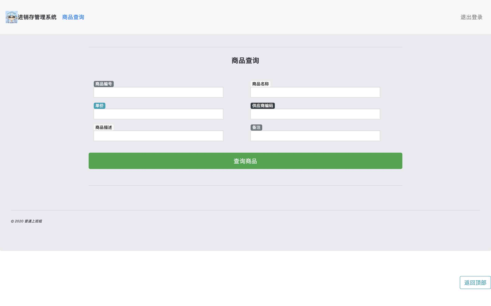
可以填写一些商品信息进行商品查询，留空则不限制。  
查询支持模糊查询，可以输入信息的一部分进行查询。

#### 订单浏览

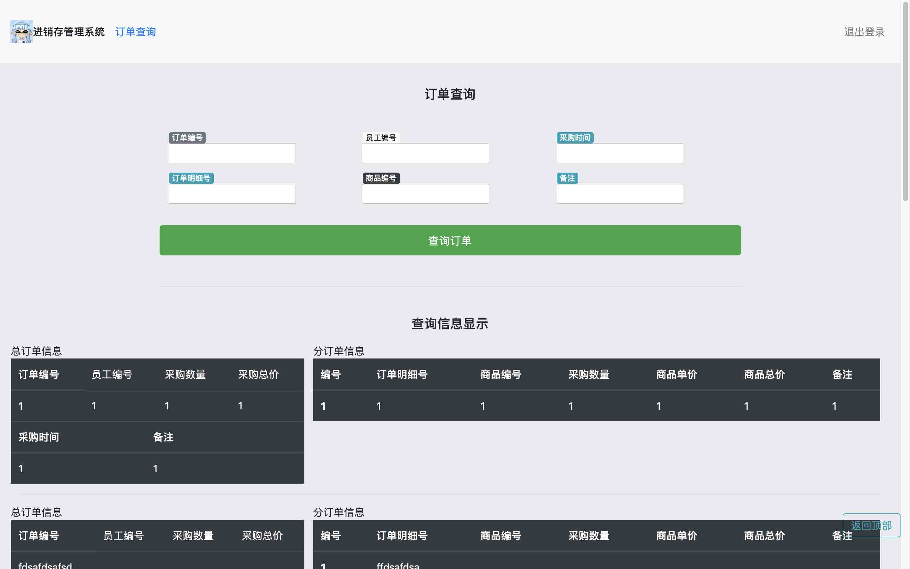
可以填写一些主订单信息进行订单查询，留空则不限制。  
查询支持模糊查询，可以输入信息的一部分进行查询。

## 使用技术

### 前端

前端使用js的jquery库和ajax来异步获取数据，动态更新页面，提高了用户体验

### 后端

后端使用python的flask框架

### 数据库

数据库部分使用了Flask-SQLAlchemy，即ORM（关系对象模型）技术

## 制作

by 普通上班组
